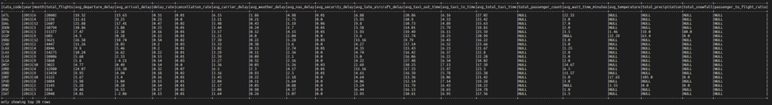

# Airport_Congestion_Prediction_System
To analyze historical flight performance, TSA wait times, TSA throughput, and weather data in order to model airport congestion patterns and recommend optimal passenger arrival times.

# In order to run the pipeline in Production, execute below commands in powershell:
$env:ENV="prod"
python -m scripts.jobs.airport

# -------------------  QUICK NOTES FOR REPORT & PRESENTATION ------------------------
# 1. BEFORE TRANSFORMATION FOR AIRPORT_CLEANED
# row count check (source file vs raw dataset)
# column uniqueness, number of nulls for each column, schema check
# analyze/clean 'city', here's the function I used to analyze/clean it accordingly

% def analyze_city(df):
%     airport_city_extracted_df = df.withColumn(
%         'extracted_state_from_city',
%         F.element_at(F.split(F.col('city'), ', '), -1)
%     )

%     airport_city_extracted_df = airport_city_extracted_df.withColumn(
%         'is_state_same',
%         F.when(F.col('extracted_state_from_city') == F.col('state_code'), 1).otherwise(0)
%     )

%     # get rows where extracted state not same as state_code
%     state_not_match = airport_city_extracted_df.filter(airport_city_extracted_df['is_state_same'] == 0)
%     print("COUNT OF extracted state <> state_code: " + str(state_not_match.count()))     # 3756

%     # from those not same as state_code, get those same as 'country'
%     same_as_country = state_not_match.filter(state_not_match['extracted_state_from_city'] == state_not_match['country'])   # 3748
%     print("COUNT OF unmatched state == country: " + str(same_as_country.count()))

%     # from those not same as state_code, get those not same as 'country'
%     not_same_as_country = state_not_match.filter(state_not_match['extracted_state_from_city'] != state_not_match['country'])   # 8
%     print("COUNT OF unmatched state != country:" + str(not_same_as_country.count()))

%     return not_same_as_country

# 2. AFTER TRANSFORMATION FOR AIRPORT_CLEANED
# ensure iata_code is unique

# 3. For pdf ingestion engineer decision
# To ensure reproducibility and stable execution within local infrastructure constraints, the PDF ingestion pipeline intentionally processes a representative subset of 150 pages per PDF document during demonstration runs. The architecture supports full-document processing, but bounded extraction was used to balance runtime efficiency, resource utilization, and iterative development speed while still preserving sufficient data volume for downstream analytics and machine learning tasks.

----------------------------------------------

WEATHER DATA

Null Counts:
CLDD: 14756
DATE: 0
ELEVATION: 0
HTDD: 14756
LATITUDE: 0
LONGITUDE: 0
NAME: 0
PRCP: 6367
SNOW: 73823
STATION: 0
TAVG: 14122
TMAX: 12523
TMIN: 13192
state: 0

ETL Pipeline - keeping nulls because they represent unavailable measurements rather than ingestion errors

--------------------------------

| Dataset                         | Strategy     
| ------------------------------- | ------------ 
| flight_performance_cleaned      | Incremental  
| tsa_throughput_cleaned          | Incremental  
| weather_cleaned                 | Incremental  
| airport_cleaned                 | Full refresh
| ontime_dept_performance_cleaned | Full refresh
| tsa_wait_time_cleaned           | Full refresh
| airport_weather_mapping         | Full refresh
| airport_congestion_gold         | Full refresh

-------------------------------------------

----------------------------------------------

Amazon S3 was used as the centralized storage repository for raw source files and finalized parquet outputs. Smaller ETL workloads were processed directly against S3 using Spark cloud-native IO integration, while larger incremental workloads involving heavy partition-level transformations and merge operations were processed locally to optimize single-node execution efficiency before persisting finalized parquet datasets back into centralized S3 storage.

---------------------------------------------

In ML preprocessing - Impute with:
median
station-level average
state-level average