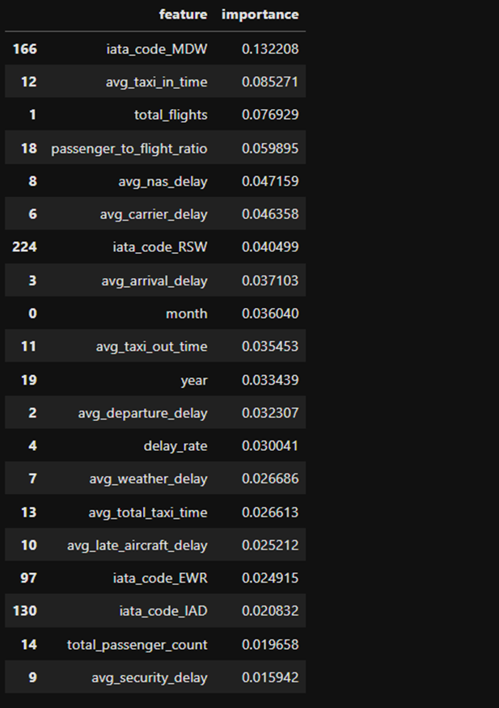

# Airport Congestion Prediction System
### End-to-End Data Engineering and Predictive Analytics Platform for Airport Congestion Estimation
---
#### Overview
The Airport Congestion Prediction System is an end-to-end data engineering and machine learning project designed to estimate airport congestion using historical aviation operations, passenger throughput, TSA wait times, and weather data.

The project integrates multiple large-scale public datasets through a PySpark-based ETL pipeline and applies machine learning techniques to predict TSA wait times, which serve as a proxy for airport congestion.

This project demonstrates modern data engineering practices, including:
- Distributed data processing with PySpark
- Multi-source data integration
- Cloud storage integration with Amazon S3
- Incremental ETL processing
- Feature engineering and predictive analytics
- Machine learning model development and evaluation
---
#### Business Problem

Passengers are commonly advised to arrive at airports using generalized recommendations, such as arriving two hours before domestic flights or three hours before international flights. These recommendations do not account for airport-specific operational conditions, passenger demand fluctuations, weather disruptions, or changing congestion patterns.

##### This project investigates whether historical operational data can be used to estimate airport congestion and support more informed and data-driven arrival recommendations.
---
#### Solution Architecture
##### Data Sources
- Bureau of Transportation Statistics (BTS)
    - Flight Performance Data
    - Airport Lookup Data
    - Airport On-Time Departure Performance Data
- Transportation Security Administration (TSA)
    - Passenger Throughput Data
    - TSA Wait Time Data
- National Oceanic and Atmospheric Administration (NOAA)
    - Historical Weather Data

##### Processing Pipeline
- Data Extraction and Ingestion
- Data Quality Validation
- Data Cleaning and Standardization
- Data Transformation and Aggregation
- Dataset Integration
- Airport Congestion Gold Dataset Creation
- Exploratory Data Analysis
- Machine Learning Model Development
- Model Evaluation and Interpretation
---
#### Architecture Diagram
 v0.2.jpg>)

##### The system architecture demonstrates how heterogeneous aviation datasets are ingested, transformed through a PySpark ETL pipeline, integrated into a unified analytical dataset, and consumed by machine-learning models for airport congestion estimation.
---
#### Technology Stack
##### Data Engineering
- Python
- PySpark
- Pandas
- NumPy
- Docker
- Amazon S3
- Parquet
##### Data Analytics & Machine Learning
- Scikit-Learn
- Matplotlib
- Seaborn
- Jupyter Notebook
##### Development Environment
- Visual Studio Code
- Dockerized Spark Environment
- AWS Command Line Interface
---
#### ETL Pipeline
The ETL pipeline processes millions of aviation records through several stages:

##### Extraction
- Ingested flight performance, TSA, airport, and weather datasets
- Processed CSV and Excel source files
##### Transformation
- Data quality validation
- Schema standardization
- Missing-value handling
- Incremental processing workflows
- Aggregation and enrichment operations
##### Loading
- Generated transformed Parquet datasets
- Created integrated airport congestion gold dataset
- Stored outputs locally and in Amazon S3
---
#### Airport Congestion Gold Dataset

The final analytical dataset combines airport operational metrics, passenger demand indicators, TSA wait times, and weather observations into a unified airport-month analytical structure.

Key features include:
- Total flight volume
- Average departure delay
- Average arrival delay
- Delay rates
- Cancellation rates
- Passenger throughput
- Average TSA wait time
- Weather metrics
- Passenger-to-flight ratio
---
#### Exploratory Data Analysis

Exploratory analysis was performed to:
- Assess data quality
- Evaluate feature distributions
- Identify outliers
- Analyze skewness
- Investigate operational variability across airports

The analysis revealed substantial variability in airport congestion behavior and identified several highly skewed operational variables requiring additional preprocessing and transformation.
---
#### Machine Learning Models

Two regression models were developed:

##### Linear Regression
Interpretable baseline model used to evaluate linear relationships between operational variables and TSA wait times.

##### Random Forest Regression
Ensemble-learning model used to capture nonlinear interactions among flight activity, passenger demand, weather conditions, and airport-specific characteristics.
---
#### Model Performance

| Model	| MAE | RMSE | R²
| Linear Regression | 3.8914 | 6.8608 | 0.2291
| Random Forest Regression | 3.3391 | 5.9880 | 0.4128

The Random Forest model achieved the strongest predictive performance, reducing prediction error by approximately 14% and explaining substantially more variation in TSA wait times than the baseline linear model.

---
#### Feature Importance Analysis

The analysis identified several highly influential predictors of airport congestion:
- Airport identifiers
- Total flight volume
- Passenger demand
- Arrival delays
- Carrier delays
- NAS delays
- Taxi times
- Passenger-to-flight ratios

The findings indicate that airport congestion results from the interaction of multiple operational and environmental conditions rather than a single isolated factor.

---
#### Key Outcomes

- Built an end-to-end PySpark ETL pipeline
- Integrated multiple heterogeneous aviation datasets
- Implemented incremental data-processing workflows
- Developed cloud-integrated data architecture using Amazon S3
- Created a unified airport congestion gold dataset
- Applied machine-learning techniques for congestion estimation
- Identified operational drivers of airport congestion
- Demonstrated scalable data engineering and predictive analytics capabilities
